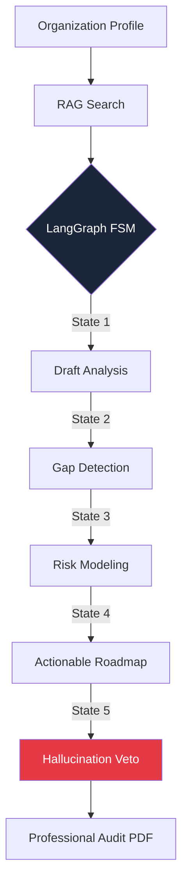

# 🛡️ ReguAI: RBI Pilot
### Agentic AI for Deterministic RBI Compliance & Policy Adaptation

**ReguAI** is a next-generation regulatory intelligence system designed to automate the lifecycle of compliance for financial institutions (NBFCs, Payment Aggregators, and Banks). Built on a unique **Deterministic Agentic Architecture**, it transforms the probabilistic nature of LLMs into a reliable, audit-ready compliance engine.

---

## 🚀 The Core Innovation: "Taming the LLM with FSM"

Standard RAG (Retrieval Augmented Generation) systems often suffer from "hallucination drift"—the AI might miss a subtle clause in a 500-page RBI Master Direction. 

ReguAI solves this by applying **Theory of Computation** concepts through a **Finite State Machine (FSM)** implemented via **LangGraph**.

### Why FSM?
Unlike standard chatbots, our agent moves through a series of **immutable states**:
1.  **DRAFT**: Initial context gathering and metadata indexing.
2.  **ANALYSIS**: Deep RAG-driven gap analysis against current RBI circulars.
3.  **IMPACT_ASSESSMENT**: High-fidelity risk modeling (HIGH/MEDIUM/LOW).
4.  **ACTION_ITEMS**: Generation of verifiable, actionable remediation roadmaps.
5.  **REVIEW**: A dedicated "Validator Node" that cross-checks the final output against original RBI PDFs to prevent hallucinations.

---

## 🛠️ Key Features

- **24/7 Regulatory Monitoring**: Automatic ingestion of RBI Master Directions and Circulars.
- **Progressive Audit Pipeline**: Watch the FSM "think" in real-time with our progression bar UI.
- **Deep PDF Analysis**: Upload your internal policies, and our Agentic AI will perform a side-by-side gap audit.
- **Hackathon-Ready Dashboard**: Professional data visualizations and real-time compliance status tracking.

---

## 🏗️ Tech Stack

- **Frontend**: React.js, Tailwind CSS, Lucide Icons, Glassmorphism UI.
- **Backend**: FastAPI (Python), LangChain, LangGraph (for FSM).
- **Intelligence**: Groq (Llama-3.3-70B) for ultra-fast deterministic reasoning.
- **Database**: MongoDB (User metadata & session persistence).
- **Vector Search**: FAISS (Facebook AI Similarity Search) for local RAG efficiency.

---

## 📈 Future Scope

- **Inter-Agency Mapping**: Map RBI rules to SEBI and IRDAI requirements simultaneously.
- **Auto-Correction Engine**: Automatically draft updated policy documents for the Board of Directors.
- **Collaborative Audits**: Multi-user support for Legal, IT, and Operations teams to verify compliance steps.

---

*Winner of "Problem Statement 3: Agentic AI for RBI Compliance"*
*Built with ❤️ for the RBI Pilot Hackathon*
